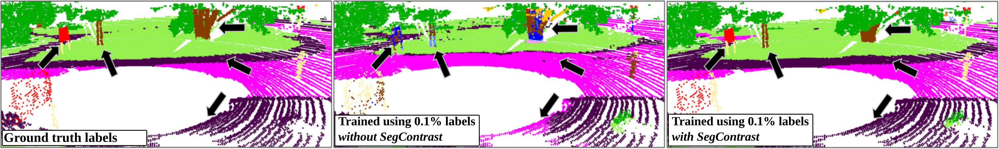

# SegContrast



Installing pre-requisites:

`sudo apt install build-essential python3-dev libopenblas-dev`

`pip3 install -r requirements.txt`

`pip3 install torch ninja`

Installing MinkowskiEngine with CUDA support:

`pip3 install -U MinkowskiEngine==0.5.4 --install-option="--blas=openblas" -v --no-deps`

# SegContrast with Docker

Inside the `docker/` directory there is a `Dockerfile` to build an image to run SegContrast. You can build the image from scratch or download the image from docker hub by:

```
docker pull nuneslu/segcontrast:minkunet
```

Then start the container with:

```
docker run --gpus all -it --rm -v /PATH/TO/SEGCONTRAST:/home/segcontrast segcontrast /bin/zsh
```

# Data Preparation

Download [SemanticKITTI](http://www.semantic-kitti.org/dataset.html#download) inside the directory ```./Datasets/SemanticKITTI/datasets```. The directory structure should be:

```
./
└── Datasets/
    └── SemanticKITTI
        └── dataset
          └── sequences
            ├── 00/           
            │   ├── velodyne/	
            |   |	├── 000000.bin
            |   |	├── 000001.bin
            |   |	└── ...
            │   └── labels/ 
            |       ├── 000000.label
            |       ├── 000001.label
            |       └── ...
            ├── 08/ # for validation
            ├── 11/ # 11-21 for testing
            └── 21/
                └── ...
```

# Pretrained Weights
- SegContrast pretraining weights ([backbone](https://www.ipb.uni-bonn.de/html/projects/segcontrast/lastepoch199_model_segment_contrast.pt) and [projection head](https://www.ipb.uni-bonn.de/html/projects/segcontrast/lastepoch199_model_head_segment_contrast.pt))

# Reproducing the results

Run the following to start the pre-training:

```
python3 contrastive_train.py --use-cuda --use-intensity --segment-contrast --checkpoint segcontrast
```

The default parameters, e.g., learning rate, batch size and epochs are already the same as the paper.

After pre-training you can run the downstream fine-tuning with:

```
python3 downstream_train.py --use-cuda --use-intensity --checkpoint \
        segment_contrast --contrastive --load-checkpoint --batch-size 2 \
        --sparse-model MinkUNet --epochs 15
```

We provide in `tools` the `contrastive_train.sh` and `downstream_train.sh` scripts to reproduce the results pre-training and fine-tuning with the different label percentages shown on the paper:

For pre-training:

```
./tools/contrastive_train.sh
```

Then for fine-tuning:

```
./tools/downstream_train.sh
```

# Citation

If you use this repo, please cite as :

```
@article{nunes2022ral,
  author = {Lucas Nunes and Rodrigo Marcuzzi and Xieyuanli Chen and Jens Behley and Cyrill Stachniss},
  title = {{SegContrast: 3D Point Cloud Feature Representation Learning through Self-supervised Segment Discrimination}},
  journal = {IEEE Robotics and Automation Letters (RA-L)},
  year = 2022
}
```
